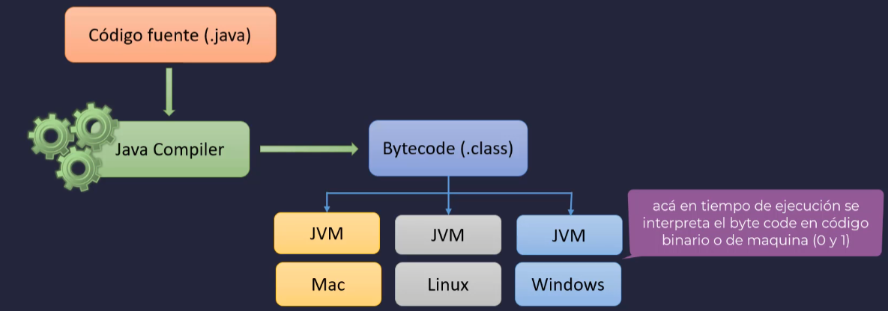

# SECCION 1: INTRODUCCION
## 1. INTRODUCCION AL CURSO
## 2. ANTES DE EMPEZAR
## 3. INSTALACION JDK
## 4. INSTALACION INTELLIJ IDEA
## 5. INTRODUCCION A JAVA

**Historia**
- Desarrollado por Sun Microsyste, en el año 1995
- Inicialmente comienza a desarrollarse en 1991 para tarjetas inteligentes y sintonizadores de TV
- Integrado por un equipo de 13 personas al mando de James Gosling
- Basado en C++
- Inicialmente llamado Oak pero finalmente fue renombrado a Java
- Lanzado publicamente y oficial en 1996 incluyendo Soporte web con el navegador HotJava
- Luego en 1998 aparecen las primeras versiones de Java EE (J2EE 1.0)

**Independiente de la plataforma**
- La idea de Gosling era que el lenguaje java fuera multiplataforma y su promesa era: Escribelo una vez, ejecutalo donde quieras
- Un lenguaje independiente del sistema operativo con un entorno de ejecucion llamado JVM (maquina virtual de Java)

**El Bytecode**
Todo codigo Java se compila en un lenguaje intermedio que no es 100% binario, esta justo entremedio de la maquina y el codigo fuente y se le conoce como Bytecode



**Caracteristicas**
- Muchos tipos de aplicaciones (consola, ventanas, web, distribuidas, etc)
- Multiplataforma
- Programacion orientada a objetos
- Recolector de basura
- Polimorfismo
- Modularidad
- Principio de ocultacion
- Lenguaje Tipado


## 6. CREANDO NUESTRA PRIMERA APLICACION
## 7. EJEMPLO HOLA MUNDO EN JAVA
```java
public class Tarea1 {
    public static void main(String[] args) {
        System.out.println("Hola Mundo");
    }
}
```

## TAREA 1: IMPRIME TU NOMBRE EN CONSOLA
```java
public class Tarea1 {
    public static void main(String[] args) {
        System.out.println("Walter Nick Suel Arroyo");
    }
}
```

# SECCION 2: VARIABLES

## 8. INTRODUCCION A LAS VARIABLES

## 9. EJEMPLOS DE VARIABLES
```java
public class Tarea1 {
    public static void main(String[] args) {
        String saludar = "Hola Mundo desde Java";
        System.out.println(saludar);
        System.out.println(saludar.toUpperCase());

        int numero = 10;
        System.out.println(numero);

        boolean valor = true;
        System.out.println(valor);

        var numero2 = 15;   //El var asigna automaticamente el tipo de dato de la variable
        System.out.println(numero2);
    }
}
```

## 10. REGLAS PARA DEFINIR UNA VARIABLE
